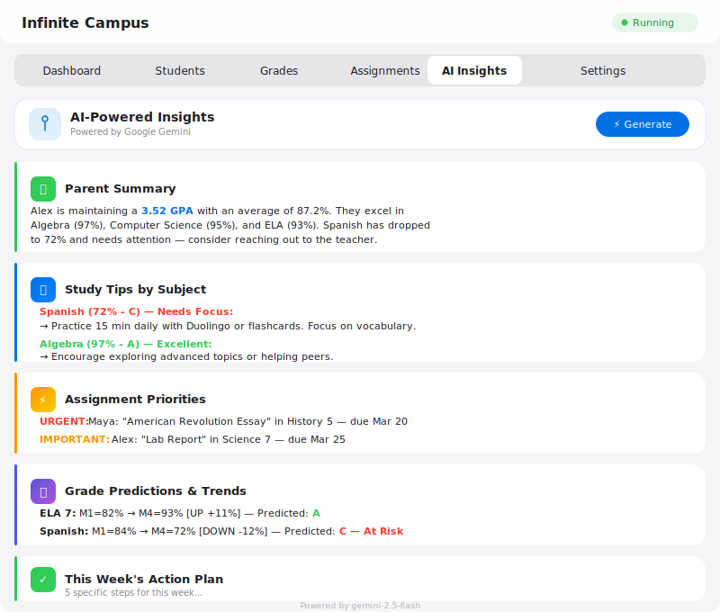
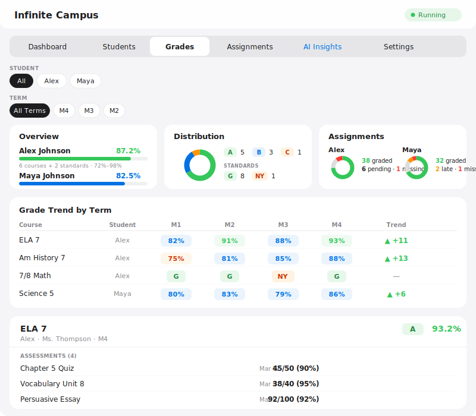
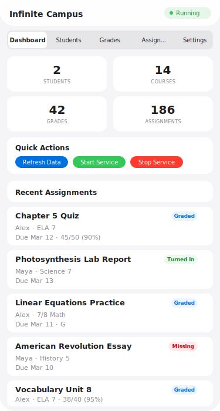

# Infinite Campus Monitor - Home Assistant Add-on

Monitor your children's grades, assignments, attendance, and school notifications from Infinite Campus — right inside Home Assistant. Get instant WhatsApp alerts when grades are posted, assignments are due or missing, and attendance changes. Automatically creates HA sensors for building your own automations.

## Screenshots

### Dashboard
Overview with stats, quick actions, interactive charts (grade trends, course performance, assignment status, GPA by student), and recent assignments.



### AI Insights
AI-powered analysis with personalized parent summaries, study tips, assignment priorities, grade predictions, and weekly action plans. Powered by Google Gemini (free).



### Grades & Insights
Filter by student and term. Grade trends across marking periods, distribution charts, and expandable course cards with individual assessments. Supports both percentage-based and standards-based grading (G/NY marks).



### Mobile View
Fully responsive — tables become card layouts on mobile for a native app feel.

<p align="center">
  
</p>

*Screenshots use sample data — no real student information.*

## Features

### Real-Time Monitoring
- **Grades**: Track course grades with letter grades, percentages, and scores per term
- **Assignments**: View all assignments with due dates, scores, and submission status (graded, missing, late, turned in)
- **Attendance**: Monitor attendance records with alerts for absences or tardies
- **Courses**: See full course roster with teachers, rooms, and periods
- **Multi-Student**: Supports multiple students on one parent account

### WhatsApp Notifications (Free via CallMeBot)
- **Grade Updates**: Notified when a new grade is posted or changed, with score and letter grade
- **New Assignments**: Alert when new assignments are posted with due dates
- **Missing Assignments**: Immediate alert when an assignment is marked missing
- **Assignment Graded**: Notification when an assignment receives a score
- **Score Changes**: Notification when an existing score is updated (shows old → new)
- **Attendance Alerts**: Alert for non-present attendance (absences, tardies)
- **Daily Summary**: Optional daily digest at your chosen time with courses, due assignments, and missing count
- **Two Phone Numbers**: Send alerts to both parents/guardians simultaneously

### Home Assistant Sensors (Automatic)
- **Per-Course Grade Sensors**: `sensor.infinite_campus_<student>_<course>` — letter grade as state, percent/score/teacher as attributes
- **Missing Assignment Sensor**: `sensor.infinite_campus_<student>_missing_assignments` — count + list of missing items
- **Upcoming Assignment Sensor**: `sensor.infinite_campus_<student>_upcoming_assignments` — assignments due in the next 7 days
- **Total Assignment Sensor**: `sensor.infinite_campus_<student>_total_assignments` — graded and turned-in counts
- **Course Sensor**: `sensor.infinite_campus_<student>_courses` — course count and list
- **Connection Sensor**: `binary_sensor.infinite_campus_connected` — add-on health monitoring
- **Last Updated Sensor**: `sensor.infinite_campus_last_updated` — timestamp with data counts

### Web Dashboard (Ingress)
- **Dashboard**: Overview stats, quick actions, 4 interactive Chart.js charts (grade trends, course performance, assignment status, GPA by student), and recent assignments
- **Students Tab**: Tabbed per-student view with enrollment info, courses, teachers, rooms
- **Grades Tab**: Student and term filters, grade trend charts across marking periods, expandable course cards with per-assignment drill-down, supports both percentage-based and standards-based grading (G/NY/E marks)
- **Assignments Tab**: Full assignment list sorted by due date with status badges (Missing/Late/Turned In/Graded)
- **AI Insights Tab**: AI-powered analysis using Google Gemini (free) — parent summaries, study tips per subject, assignment priorities, grade predictions, and weekly action plans
- **Settings Tab**: Connection status, WhatsApp setup guide, Gemini API key configuration
- **Mobile-First**: Responsive design — tables become card layouts on phones for a native app feel

## Installation

### Step 1: Add the Repository
1. In Home Assistant go to **Settings → Add-ons → Add-on Store**
2. Click the three dots in the top right → **Repositories**
3. Add: `https://github.com/macguy81/ha-infinite-campus`
4. Click **Add** then **Close**

### Step 2: Install the Add-on
1. Find **Infinite Campus Monitor** in the add-on store
2. Click **Install**
3. Wait for the build to complete

### Step 3: Configure
Go to the add-on's **Configuration** tab and fill in:

| Setting | Description | Example |
|---------|-------------|---------|
| `ic_base_url` | Your district's IC URL | `https://downingtownpa.infinitecampus.org` |
| `ic_district` | District identifier (appName) | `downingtown` |
| `ic_username` | Your parent portal username | `your_username` |
| `ic_password` | Your parent portal password | `your_password` |
| `whatsapp_phone` | Phone with country code | `+12125551234` |
| `whatsapp_api_key` | CallMeBot API key | `123456` |
| `whatsapp_phone_2` | Optional second phone | `+12125554567` |
| `whatsapp_api_key_2` | Optional second API key | `654321` |
| `poll_interval` | Seconds between refreshes (300-7200) | `900` |
| `notify_grades` | WhatsApp on grade changes | `true` |
| `notify_assignments` | WhatsApp on new/missing assignments | `true` |
| `notify_attendance` | WhatsApp on attendance changes | `true` |
| `notify_notifications` | WhatsApp on school notifications | `true` |
| `daily_summary` | Send daily summary | `true` |
| `daily_summary_hour` | Hour (0-23) for daily summary | `18` |
| `auto_start` | Auto-start on add-on boot | `true` |

### Step 4: Start
1. Click **Start** on the add-on
2. Open the **Web UI** to see the dashboard
3. Check the **Log** tab to verify authentication and data fetching

## Finding Your District Info

Visit your Infinite Campus login page:
1. The URL is your **Base URL** (e.g., `https://downingtownpa.infinitecampus.org`)
2. Right-click → Inspect → search for `appName` in the page source — that's your **District** (e.g., `downingtown`)

## WhatsApp Setup (CallMeBot - Free)

1. Save **+34 644 51 95 23** as a contact in your phone
2. Send **"I allow callmebot to send me messages"** to that number on WhatsApp
3. You will receive a message with your **API key**
4. Enter your phone number (with country code, e.g., `+12125551234`) and API key in the add-on Configuration tab
5. Repeat for the second phone number if desired

CallMeBot is free with a fair-use limit of ~25 messages per day.

## Home Assistant Automation Examples

### Alert when a grade drops below C (70%)

```yaml
automation:
  - alias: "IC Grade Drop Alert"
    trigger:
      - platform: state
        entity_id: sensor.infinite_campus_aarav_adhikari_ela_7
    condition:
      - condition: template
        value_template: >
          {{ state_attr('sensor.infinite_campus_aarav_adhikari_ela_7', 'percent') | float(100) < 70 }}
    action:
      - service: notify.mobile_app_your_phone
        data:
          title: "Grade Alert - ELA 7"
          message: >
            Grade dropped to {{ states('sensor.infinite_campus_aarav_adhikari_ela_7') }}
            ({{ state_attr('sensor.infinite_campus_aarav_adhikari_ela_7', 'percent') }}%)
```

### Alert when missing assignments detected

```yaml
automation:
  - alias: "IC Missing Assignment Alert"
    trigger:
      - platform: numeric_state
        entity_id: sensor.infinite_campus_aarav_adhikari_missing_assignments
        above: 0
    action:
      - service: notify.mobile_app_your_phone
        data:
          title: "Missing Assignment!"
          message: >
            Aarav has {{ states('sensor.infinite_campus_aarav_adhikari_missing_assignments') }}
            missing assignment(s)
```

### Turn on desk lamp when assignments are due tomorrow

```yaml
automation:
  - alias: "IC Homework Reminder"
    trigger:
      - platform: numeric_state
        entity_id: sensor.infinite_campus_aarav_adhikari_upcoming_assignments
        above: 0
    condition:
      - condition: time
        after: "16:00:00"
    action:
      - service: light.turn_on
        target:
          entity_id: light.desk_lamp
        data:
          color_name: blue
```

### HA Dashboard Card

```yaml
type: entities
title: "Infinite Campus"
entities:
  - entity: binary_sensor.infinite_campus_connected
  - entity: sensor.infinite_campus_aarav_adhikari_ela_7
  - entity: sensor.infinite_campus_aarav_adhikari_am_history_7
  - entity: sensor.infinite_campus_aarav_adhikari_7_8_math
  - entity: sensor.infinite_campus_aarav_adhikari_missing_assignments
  - entity: sensor.infinite_campus_aarav_adhikari_upcoming_assignments
```

## Notification Types

| Event | WhatsApp Message | HA Entity Updated |
|-------|-----------------|-------------------|
| Grade posted/changed | Score, percentage, letter grade per course | `sensor.ic_<student>_<course>` |
| New assignment | Assignment name, course, due date | `sensor.ic_<student>_upcoming_assignments` |
| Assignment graded | Score and percentage | `sensor.ic_<student>_total_assignments` |
| Assignment missing | Assignment name and course | `sensor.ic_<student>_missing_assignments` |
| Score updated | Old → New score | `sensor.ic_<student>_<course>` |
| Attendance event | Status, period, date | N/A |
| Daily summary | All stats per student | All entities |

## Architecture

```
ha-infinite-campus/
├── repository.yaml              # HA add-on repository config
├── README.md                    # This file
├── LICENSE
└── infinite_campus/
    ├── config.yaml              # Add-on config + schema
    ├── Dockerfile               # Docker build
    └── app/
        ├── run.sh               # Startup script
        ├── server.py            # aiohttp web server + REST API
        ├── infinite_campus_api.py  # IC portal auth + data fetching
        ├── scheduler.py         # Poll loop + change detection + notifications
        ├── whatsapp_notify.py   # CallMeBot WhatsApp integration
        ├── ha_entities.py       # HA Supervisor API sensor management
        └── templates/
            └── index.html       # Dashboard web UI
```

### IC API Endpoints Used

The add-on tries multiple patterns and uses whichever works for your district:

| Endpoint | Purpose |
|----------|---------|
| `api/portal/students` | Student list with enrollments |
| `resources/portal/grades` | Course grades (tries: no params → personID → studentID → enrollment params) |
| `resources/portal/roster` | Course roster with teachers and placements |
| `api/portal/assignment/listView` | Assignments with scores, due dates, and status flags |
| `resources/portal/attendance` | Attendance records |
| `resources/term` | Academic terms |
| `resources/calendar/instructionalDay` | Schedule and calendar |

## Troubleshooting

**Add-on won't start**: Check the Log tab. Verify IC URL and credentials are correct.

**No data showing**: Click "Refresh Data" in the dashboard. Check logs for "Poll complete" messages.

**Grades empty**: Check the add-on Log tab for messages about which API endpoints are returning data.

**WhatsApp not sending**: Complete the CallMeBot setup. Phone number must include country code (`+1` for US).

**HA entities not appearing**: Check logs for "Updated X HA entities". Entities appear in Developer Tools → States.

**Schema not updating after version change**: HA caches Docker images. Fully uninstall the add-on, remove the repository, re-add it, and reinstall.

## Privacy

All data stays local on your Home Assistant instance. No data is sent to any third party except:
- Infinite Campus (to fetch your student data with your credentials)
- CallMeBot (only if WhatsApp notifications are configured, sends notification text only)
- Google Gemini API (only if AI Insights is configured, sends grade/assignment summaries for analysis)

## License

MIT License. This project is not affiliated with Infinite Campus, Inc.

## Disclaimer

This is an unofficial, community-developed add-on. Not affiliated with or endorsed by Infinite Campus, Inc. Use for personal purposes only and comply with your school district's data policies.
